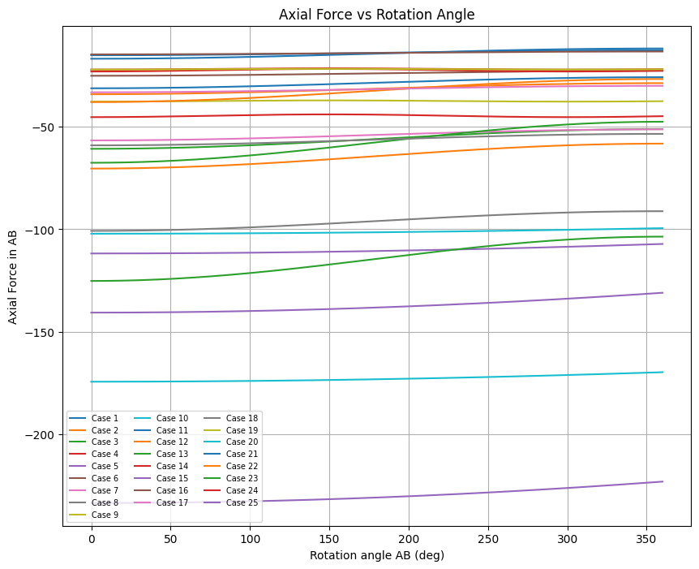

# Planar-two-link-rotating-mechanism

Highest tensile force occurs when both masses are large, $\omega_1$ is high, $\omega_2$ opposes $\omega_1$ strongly, and $L_2$ is large.

Highest compression occurs when acceleration of C aligns toward A, relative speed ($\omega_1-\omega_2$) is large, and BC length is large.

$\omega^2$ scaling dominates everything
